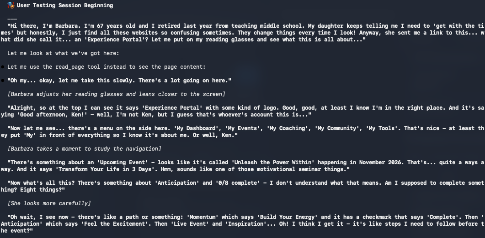

# User Testing Agent

A Claude Code plugin that simulates realistic user personas for UX testing. The agent embodies different user archetypes with authentic behaviors, timing patterns, and frustration triggers to identify usability issues before real users encounter them.



## Features

- **25 Personas** across 6 categories with gender variants (75 total personalities)
- **Multi-Persona Testing** to compare experiences across user types
- **Session Recording** with Playwright Trace export
- **A/B Testing** to compare URL variants
- **Mobile/Tablet/Desktop** viewport testing
- **Network Throttling** (slow-3g, fast-3g, offline)
- **WCAG Audit** with compliance scoring
- **Cookie Consent Audit** for GDPR/CCPA compliance
- **Form Fuzzing** for security testing (XSS, SQLi, unicode)
- **Stripe Checkout Testing** with official test cards
- **GitHub PR Comments** for CI/CD integration
- **JSON Export** for pipeline automation

## Quick Start

### Prerequisites

- Claude Code CLI (v2.0.73+)
- Claude in Chrome extension (v1.0.36+)
- Google Chrome browser

### Installation

```bash
# In Claude Code
/plugins
# Select "Add Marketplace" and enter:
ncklrs/claude-chrome-user-testing
```

### Basic Usage

```bash
# Start Claude with Chrome
claude --chrome

# Run a user test
/user-test --url https://example.com --persona genz-digital-native

# With tasks
/user-test --url https://shop.example.com --persona boomer-tech-averse --tasks "find product, checkout"
```

## Available Personas

| Category | Personas |
|----------|----------|
| **Generational** | `boomer-tech-averse`, `boomer-tech-friendly`, `millennial-tech-skeptic`, `genz-digital-native`, `genalpha-tablet-kid` |
| **Accessibility** | `screen-reader-user`, `low-vision-user`, `keyboard-only-user`, `cognitive-adhd-user` |
| **Professional** | `busy-executive`, `developer-critic`, `designer-critic`, `support-agent` |
| **Context** | `bad-connection-user`, `distracted-parent`, `non-native-english`, `power-user` |
| **Shopping** | `comparison-shopper`, `impulse-buyer`, `return-customer`, `gift-buyer` |
| **International** | `german-business-user`, `japanese-user`, `arabic-rtl-user`, `brazilian-user` |

See [docs/personas.md](docs/personas.md) for detailed persona documentation.

## Commands

| Command | Purpose |
|---------|---------|
| `/user-test` | Main testing command with all options |
| `/stripe-test` | Dedicated Stripe checkout testing |
| `/ab-test` | Compare two URL variants |
| `/smoke-test` | Quick validation with presets |
| `/critical-path` | Test must-work journeys |
| `/check-links` | Find broken links |
| `/wcag-audit` | WCAG 2.1 accessibility audit |
| `/cookie-audit` | GDPR/CCPA compliance audit |
| `/user-test-create-persona` | Create custom personas |

See [docs/commands.md](docs/commands.md) for full command reference.

## Common Examples

```bash
# Multi-persona comparison
/user-test --url https://example.com --personas "boomer-tech-averse,genz-digital-native" --quiet

# Mobile + slow network
/user-test --url https://example.com --persona impulse-buyer --viewport mobile --network slow-3g

# Stripe checkout testing
/stripe-test --url https://shop.example.com/checkout --card success

# A/B testing
/ab-test --url-a https://example.com --url-b https://staging.example.com --persona genz-digital-native

# Security fuzzing
/user-test --url https://example.com/signup --persona developer-critic --fuzz

# Cookie compliance
/cookie-audit --url https://example.com --regulation gdpr

# CI/CD with PR comment
/user-test --url https://staging.example.com --persona genz-digital-native --quiet --pr 123
```

## CI/CD Integration

```yaml
- name: Run User Tests
  env:
    ANTHROPIC_API_KEY: ${{ secrets.ANTHROPIC_API_KEY }}
  run: |
    claude --chrome "/user-test \
      --url ${{ env.PREVIEW_URL }} \
      --persona genz-digital-native \
      --quiet \
      --output json \
      --pr ${{ github.event.pull_request.number }}"
```

## Documentation

- [Personas](docs/personas.md) - All 25 personas with behaviors and timing
- [Commands](docs/commands.md) - Full command reference
- [Features](docs/features.md) - Detailed feature documentation
- [Ralph Loop](docs/ralph.md) - Autonomous testing with Ralph Wiggum

## Plugin Structure

```
user-testing-agent/
├── commands/           # Command definitions
├── agents/             # Testing agent
├── skills/             # Feature implementations
│   ├── user-testing/   # Personas and behaviors
│   ├── stripe-checkout/# Payment testing
│   ├── wcag-auditor/   # Accessibility audit
│   ├── cookie-auditor/ # Privacy compliance
│   ├── form-fuzzer/    # Security testing
│   └── ...
├── docs/               # Documentation
└── README.md
```

## Contributing

See [CONTRIBUTING.md](CONTRIBUTING.md) for guidelines on adding personas.

## License

MIT - See [LICENSE](LICENSE)
